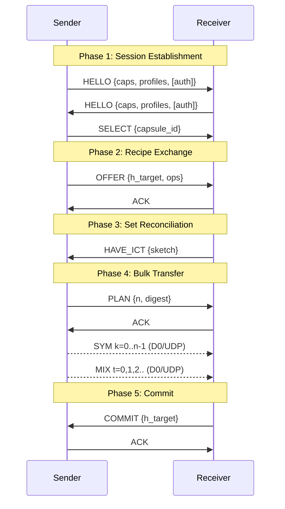
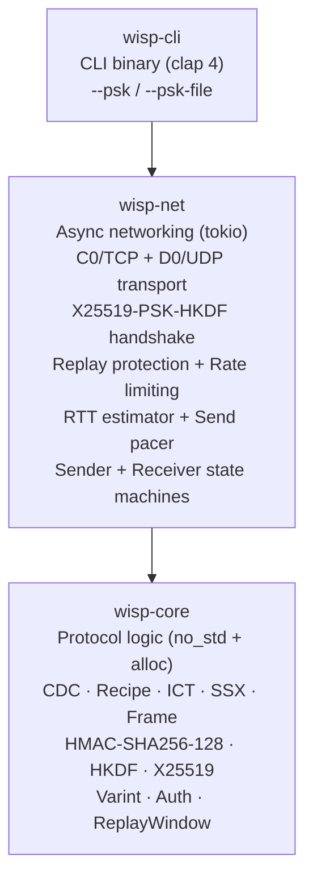
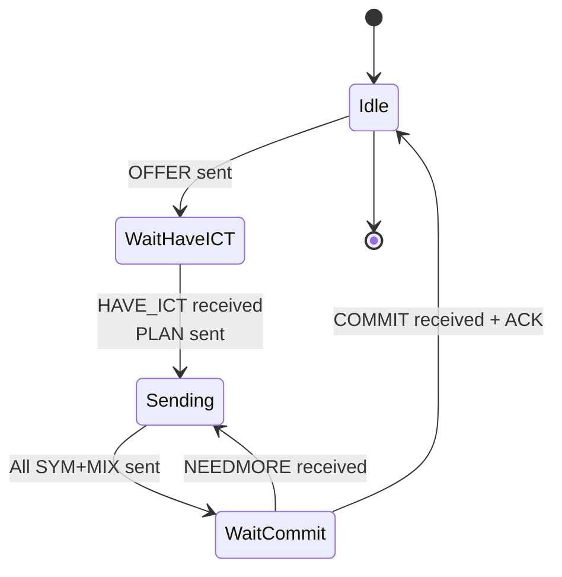
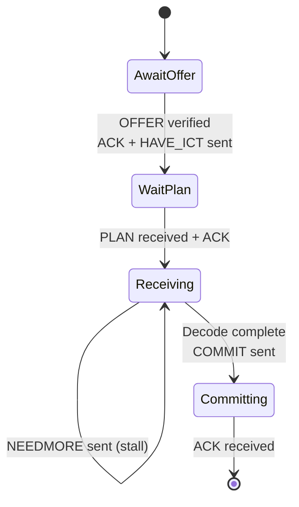
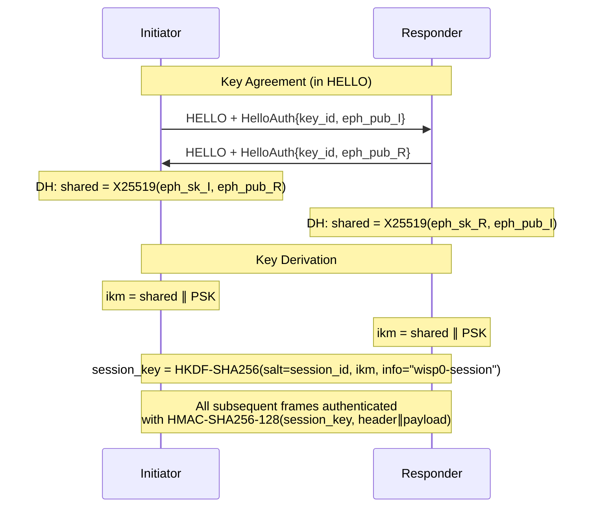

# WISP-0

**Wire-level Incremental Sync Protocol with CSR/0 Profile**

A bandwidth-efficient application-layer protocol for incremental synchronization of opaque binary objects, composing content-defined chunking, invertible count tables, and systematic fountain coding. When both sides provide a base file, only changed and new chunks are transferred. Optional X25519-PSK-HKDF authentication provides per-session forward secrecy and frame-level HMAC integrity.

| Property | Value |
|:---|:---|
| Protocol Version | `0` |
| Profile | CSR/0 (Chunking-Sketch-Rateless) |
| Implementation | Rust 2021, `no_std`-compatible core |
| Test Coverage | 143 tests (119 unit + 3 integration + 4 incremental + 7 loopback + 10 session) |
| Source Lines | ~7,100 LOC across 4 crates |

---

## Table of Contents

- [Motivation](#motivation)
- [Protocol Overview](#protocol-overview)
- [Architecture](#architecture)
- [Crate Structure](#crate-structure)
- [Core Algorithms](#core-algorithms)
  - [Content-Defined Chunking (CSR/0)](#content-defined-chunking-csr0)
  - [Set Reconciliation (ICT/0)](#set-reconciliation-ict0)
  - [Fountain Coding (SSX/0)](#fountain-coding-ssx0)
- [Wire Format](#wire-format)
  - [Frame Header](#frame-header)
  - [Frame Types](#frame-types)
  - [RecipeOps/0 Delta Format](#recipeops0-delta-format)
- [Protocol State Machine](#protocol-state-machine)
- [Security](#security)
  - [X25519-PSK-HKDF Authentication](#x25519-psk-hkdf-authentication)
  - [HMAC-SHA256-128 Frame Authentication](#hmac-sha256-128-frame-authentication)
  - [Replay Protection](#replay-protection)
  - [Session Limits](#session-limits)
  - [Per-IP Auth Rate Limiting](#per-ip-auth-rate-limiting)
  - [Anti-Downgrade Protection](#anti-downgrade-protection)
  - [Key Identity](#key-identity)
  - [Zeroize](#zeroize)
  - [Remaining Considerations](#remaining-considerations)
- [Operational Features](#operational-features)
  - [EWMA RTT Estimator](#ewma-rtt-estimator)
  - [D0 Send Pacer](#d0-send-pacer)
  - [NEEDMORE Receiver Logic](#needmore-receiver-logic)
- [Getting Started](#getting-started)
  - [Build](#build)
  - [Run Tests](#run-tests)
  - [CLI Usage](#cli-usage)
  - [Conformance Vectors](#conformance-vectors)
- [`no_std` Support](#no_std-support)
- [Documentation](#documentation)
- [References](#references)
- [License](#license)

---

## Motivation

Synchronizing large binary objects (firmware images, database snapshots, ML model weights, container layers) across networks is a fundamental distributed systems problem. Existing approaches have well-known limitations:

| Approach | Limitation |
|:---|:---|
| **rsync** | $O(\log n)$ round trips for checksum negotiation; fixed-block decomposition causes $O(n)$ chunk invalidation on a single-byte insertion |
| **IPFS / CAS** | Full block-list exchange or multi-round Bloom filter reconciliation for set difference |
| **Binary diff (bsdiff, xdelta)** | Requires random access to both versions simultaneously; not suitable for streaming or network-first workflows |

WISP-0 addresses all three by combining:

1. **Content-Defined Chunking** (CDC) -- edit-local decomposition: a single-byte edit affects $O(1)$ chunks
2. **Invertible Count Tables** (ICT) -- single-round-trip set reconciliation: exact missing set recovery from a compact sketch
3. **Systematic Fountain Coding** (SSX) -- rateless erasure resilience: recovery from arbitrary packet loss without retransmission

The result is a protocol that transfers *exactly* the missing bytes (plus coding overhead), completes in a fixed number of round trips regardless of object size, and tolerates arbitrary loss patterns on the bulk data channel.

---

## Protocol Overview

A WISP-0 synchronization session proceeds in five phases:



---

## Architecture

The layered design enforces a strict dependency direction: `wisp-core` has zero networking dependencies and is `no_std`-compatible. `wisp-net` adds async I/O, authentication handshake orchestration, replay protection, RTT estimation, and rate limiting. `wisp-cli` adds CLI parsing with PSK configuration.



---

## Crate Structure

```
wsisp/
├── wisp-core/          Protocol logic (no_std compatible, ~4,460 LOC)
│   ├── src/
│   │   ├── types.rs        ChunkId, Digest32, RecipeEntry, constants
│   │   ├── error.rs        WispError enum (19 variants)
│   │   ├── varint.rs       ULEB128 variable-length integer encoding
│   │   ├── chunk_id.rs     H128 / H256 SHA-256 helpers
│   │   ├── chunker.rs      CSR/0 rolling-hash CDC
│   │   ├── recipe.rs       Recipe wire format, digest
│   │   ├── recipe_ops.rs   RecipeOps/0 diff / apply
│   │   ├── ict.rs          ICT/0 set reconciliation
│   │   ├── ssx.rs          SSX/0 fountain encoder + PRNG
│   │   ├── ssx_decoder.rs  GF(2) Gaussian elimination decoder
│   │   ├── frame.rs        12 frame types, 80-byte header, HMAC trailer
│   │   └── auth.rs         X25519-PSK-HKDF, HMAC-SHA256-128, ReplayWindow, key_id
│   └── tests/
│       ├── incremental.rs  Delta sync scenarios (v1 → v2)
│       └── loopback.rs     In-process protocol round-trips
├── wisp-net/           Async networking (Tokio, ~1,950 LOC)
│   ├── src/
│   │   ├── transport.rs    C0Transport (TCP), D0Transport (UDP)
│   │   ├── session.rs      HELLO/SELECT handshake, frame_id tracking,
│   │   │                   auth negotiation, EWMA RTT, session limits
│   │   ├── sender.rs       run_sender() async state machine, D0 send pacer
│   │   ├── receiver.rs     run_receiver() async state machine, NEEDMORE logic
│   │   └── chunk_store.rs  In-memory ChunkId → bytes map
│   └── tests/
│       ├── loopback.rs     End-to-end async network tests
│       └── session.rs      Session unit tests (auth, replay, rate limiting)
├── wisp-cli/           CLI binary (send / recv, ~190 LOC)
├── wisp-vectors/       Conformance vector generator / verifier (~510 LOC)
├── vectors/            Generated conformance vectors (JSON)
└── docs/               RFC Internet-Draft + arxiv paper (LaTeX)
```

---

## Core Algorithms

### Content-Defined Chunking (CSR/0)

CSR/0 uses a Rabin-variant polynomial rolling hash over a sliding window to place chunk boundaries at content-determined positions.

**Rolling hash update** for each input byte $x_i$:

$$h_i = h_{i-1} \cdot B + x_i - y_i \cdot B^W \pmod{2^{64}}$$

where $y_i$ is the byte leaving the ring buffer.

**Boundary condition:**

```math
(\text{chunk\_size} \geq \text{MIN}) \wedge (h_i \mathbin{\&} \text{MASK} = 0) \quad\text{OR}\quad \text{chunk\_size} = \text{MAX}
```

| Parameter | Value | Description |
|:---|---:|:---|
| $B$ | 257 | Hash base |
| $W$ | 48 | Window size (bytes) |
| $K$ | 16 | Mask bit width |
| MIN | 8,192 | Minimum chunk size (8 KiB) |
| MAX | 262,144 | Maximum chunk size (256 KiB) |
| MASK | `0xFFFF` | $(1 \ll K) - 1$ |

The expected average chunk size is $2^K = 65{,}536$ bytes (64 KiB), bounded by $[\text{MIN}, \text{MAX}]$ for interior chunks. $B^W \bmod 2^{64}$ is precomputed at compile time.

> [!IMPORTANT]
> The rolling hash state (ring buffer + hash value) persists across chunk boundaries within a single chunking operation. This ensures **CDC continuity**: identical byte sequences preceded by identical context always produce identical chunk boundaries and ChunkIds.

**Edit locality**: a modification of $\delta$ consecutive bytes affects at most $\lceil\delta / \text{MIN}\rceil + 2$ chunks. All chunks entirely outside the modified region retain identical ChunkIds.

**Chunk identifier:**

```math
\text{ChunkId} = \text{SHA-256}(\text{chunk\_data})[0{:}16]
```

The first 16 bytes (128 bits) of SHA-256, providing $\sim 2^{64}$ collision resistance under the birthday bound.

---

### Set Reconciliation (ICT/0)

ICT/0 (Invertible Count Table, version 0) enables exact set-difference recovery in a single round trip. Given the sender's target chunk set $A$ and the receiver's held chunk set $B$, the missing set $A \setminus B$ is recovered from the element-wise subtraction of their ICT sketches.

**Table structure:** $m = 2^{m_{\log_2}}$ cells, each 28 bytes:

| Field | Type | Size | Description |
|:---|:---|---:|:---|
| `count` | `i32` | 4 B | Signed insertion counter |
| `key_xor` | `[u8; 16]` | 16 B | XOR accumulator of keys |
| `hash_xor` | `u64` | 8 B | XOR accumulator of `hash64` |

**Hash functions** ($k = 3$, SHA-256-derived with domain separation):

$$\text{hash64}(\text{key}) = \text{LE}_{64}\bigl(\text{SHA-256}(\texttt{0x49} \| \text{key})[0{:}8]\bigr)$$

$$h_j(\text{key}, m) = \text{LE}_{64}\bigl(\text{SHA-256}((\texttt{0xA0} + j) \| \text{key})[0{:}8]\bigr) \bmod m \qquad j \in \{0, 1, 2\}$$

**Table sizing** from estimated missing count $d$:

```math
m = \max\bigl(\text{next\_pow2}\bigl(\lceil 2.5d + 32 \rceil\bigr),\; 256\bigr)
```

Integer arithmetic equivalent (no floating point):

$$\text{raw} = \lfloor(5d + 65) / 2\rfloor$$

The $2.5\times$ overhead factor is well above the $k=3$ random hypergraph peelability threshold ($\approx 1.222$), yielding exponentially small peel failure probability.

**Operations:**

1. **Insert**: for each of 3 hash positions, increment `count`, XOR the key into `key_xor`, XOR `hash64(key)` into `hash_xor`
2. **Subtract**: element-wise: `count` difference, XOR of `key_xor` and `hash_xor`
3. **Peel**: iteratively extract pure cells ($|\text{count}| = 1$ and `hash64(key_xor) == hash_xor`), removing extracted keys and cascading

> [!TIP]
> The ICT sizing formula `max(next_pow2(ceil(2.5d + 32)), 256)` with `MAX_M_LOG2 = 24` bounds memory to at most ~448 MiB for the largest tables while guaranteeing high peel success rates even for small $d$.

---

### Fountain Coding (SSX/0)

SSX/0 (Sparse Systematic XOR, version 0) provides rateless erasure coding. The sender transmits systematic symbols (original data) followed by an unlimited stream of coded repair symbols. The receiver recovers from arbitrary packet loss without retransmission requests.

**Source symbol construction:**
1. Order missing chunks by first appearance in the target Recipe
2. Split each chunk into $`\lceil\text{chunk\_len} / L\rceil`$ symbols of $L = 1024$ bytes (zero-padded)
3. Number consecutively: $s_0, s_1, \ldots, s_{n-1}$

**PRNG:** SHA-256 hash chain. Seed for fountain index $t$:

```math
\text{seed}_t = \text{SHA-256}\bigl(\texttt{"SSX0"} \| \text{session\_id}_{64} \| \text{object\_id}_{64} \| \text{update\_id}_{64} \| t_{32}\bigr)
```

All integers are little-endian encoded. The session/object/update context provides domain separation across transfers.

**Degree distribution** (first PRNG byte $b$):

| Byte Range | Degree $d$ | Probability |
|:---|---:|---:|
| $[0, 128)$ | 3 | 50.0% |
| $[128, 192)$ | 5 | 25.0% |
| $[192, 224)$ | 9 | 12.5% |
| $[224, 256)$ | 17 | 12.5% |

Expected degree: $\mathbb{E}[d] = 0.5 \times 3 + 0.25 \times 5 + 0.125 \times 9 + 0.125 \times 17 = 5.0$

**Encoding** (coded symbol for index $t$):

$$c_t = \bigoplus_{i \in \mathcal{I}_t} s_i$$

where $\mathcal{I}_t$ contains $d_t$ indices drawn via PRNG, and $\oplus$ is byte-wise XOR.

**Decoding:** Sparse GF(2) Gaussian elimination with iterative peeling. The decoder maintains:
- **Known store**: index $\to$ $L$-byte symbol
- **Pivot table**: sparse bitmask equations with RHS payloads

Each incoming symbol (SYM or MIX) adds one linear equation. Known symbols are back-substituted, and single-variable equations are immediately resolved. Decoding completes when $|\text{known}| = n$.

> [!NOTE]
> The systematic design means SYM frames carry original data directly. If no packets are lost, the receiver needs exactly $n$ SYM frames. MIX frames provide redundancy: empirically, complete recovery requires $\sim n(1 + \varepsilon)$ total symbols with $\varepsilon \approx 0.05\text{--}0.10$.

---

## Wire Format

### Frame Header

Every WISP-0 frame begins with an **80-byte header** (all fields little-endian):

| Offset | Size | Field | Type | Description |
|---:|---:|:---|:---|:---|
| 0 | 2 | `magic` | `u16` | `0x5057` (wire: `57 50`) |
| 2 | 1 | `version` | `u8` | Protocol version (`0`) |
| 3 | 1 | `frame_type` | `u8` | Frame type code |
| 4 | 2 | `flags` | `u16` | Bit 0: `FLAGS_AUTH_HMAC` (see below) |
| 6 | 4 | `payload_len` | `u32` | Payload byte count |
| 10 | 8 | `session_id` | `u64` | Session identifier |
| 18 | 8 | `object_id` | `u64` | Object identifier |
| 26 | 8 | `update_id` | `u64` | Update sequence number |
| 34 | 8 | `frame_id` | `u64` | Control frame sequence number |
| 42 | 4 | `capsule_id` | `u32` | Profile identifier |
| 46 | 1 | `chan` | `u8` | `0` = control, `1` = data |
| 47 | 1 | `rsv0` | `u8` | Reserved, must be `0` |
| 48 | 32 | `base_digest` | `[u8; 32]` | SHA-256 of base recipe |

Session-scoped frames (HELLO, SELECT) set `object_id`, `update_id`, and `base_digest` to zeros. Data frames (SYM, MIX) set `frame_id` to `0`.

**Flags field:**

| Bit | Name | Description |
|---:|:---|:---|
| 0 | `FLAGS_AUTH_HMAC` (`0x0001`) | Frame carries a 16-byte HMAC-SHA256-128 trailer appended after the payload. When set, the on-wire frame is: `header (80B) || payload || hmac (16B)`. The HMAC covers `header || payload` under the session key. |
| 1-15 | (reserved) | Must be `0` |

### Frame Types

| Code | Name | Chan | Payload | Description |
|:---|:---|:---:|---:|:---|
| `0x01` | HELLO | 0 | $\geq$ 14 B | Capability advertisement (+ optional `HelloAuth`) |
| `0x02` | SELECT | 0 | 8 B | Profile selection |
| `0x03` | OFFER | 0 | $\geq$ 32 B | Target recipe + RecipeOps delta |
| `0x04` | HAVE_ICT | 0 | variable | Receiver's ICT sketch |
| `0x05` | ICT_FAIL | 0 | 4 B | ICT peel failure notification |
| `0x06` | PLAN | 0 | 40 B | Transfer parameters + missing digest |
| `0x07` | NEEDMORE | 0 | 4 B | Request additional MIX symbols |
| `0x08` | COMMIT | 0 | 32 B | Target digest confirmation |
| `0x09` | ACK | 0 | 8 B | Frame acknowledgment |
| `0x0A` | FORK | 0 | 68 B | Integrity divergence signal |
| `0x20` | SYM | 1 | 1028 B | Systematic source symbol |
| `0x21` | MIX | 1 | 1028 B | Coded repair symbol |

### RecipeOps/0 Delta Format

Compact delta encoding from a base Recipe to a target Recipe:

| Opcode | Code | Parameters | Semantics |
|:---|:---:|:---|:---|
| END | `0x00` | (none) | Terminate stream |
| COPY | `0x01` | `base_index`: ULEB128, `count`: ULEB128 | Copy `count` entries from base at `base_index` |
| LIT | `0x02` | `count`: ULEB128, then `count` $\times$ (ChunkId + ULEB128 len) | Literal new entries |

---

## Protocol State Machine

### Session Establishment

```
Sender                                Receiver
  │── HELLO {caps, profiles, [auth]}──>│
  │<── HELLO {caps, profiles, [auth]}──│
  │── SELECT {capsule_id, ver} ──────>│
```

Capabilities are negotiated by taking the minimum of each parameter:
- `max_control_payload`
- `max_data_payload`
- `max_m_log2`
- `max_symbols`

When PSK is configured, both HELLO frames include a `HelloAuth` extension containing `key_id` and an ephemeral X25519 public key. On successful key agreement, all subsequent frames are HMAC-authenticated (see [Security](#security)).

### Update Cycle

**Sender states:** `IDLE` -> `WAIT_HAVE_ICT` -> `SENDING` -> `WAIT_COMMIT` -> `IDLE`

**Receiver states:** `IDLE` -> `WAIT_PLAN` -> `RECEIVING` -> `COMMITTING` -> `IDLE`





> [!IMPORTANT]
> The update cycle requires exactly **4 round trips** on C0 in the common case (no NEEDMORE), independent of object size. This is in contrast to rsync's $O(\log n)$ round trips.

### Integrity Verification Chain

Each phase includes a cryptographic verification step:

1. **OFFER**: Receiver verifies $`H_{\text{target}} = \text{SHA-256}(\text{RecipeWire}(\text{applied\_ops}))`$
2. **PLAN**: Receiver verifies `missing_digest` against its locally computed missing list
3. **Decode**: Receiver verifies $`H_{128}(\text{chunk\_data}) = \text{ChunkId}`$ for each reconstructed chunk
4. **COMMIT**: Sender verifies the receiver's $H_{\text{target}}$ matches the originally offered digest

> [!WARNING]
> If any verification fails, the detecting party sends a **FORK** frame with the expected and observed digests. FORK is a terminal condition for the current update cycle -- the session must either retry or abort.

---

## Security

WISP-0 provides an optional security layer based on pre-shared keys (PSK) with ephemeral Diffie-Hellman key exchange, delivering per-session forward secrecy, frame-level authentication, and replay protection.

### X25519-PSK-HKDF Authentication

When both peers are configured with a PSK, the HELLO handshake is extended with ephemeral X25519 key exchange and HKDF-SHA256 key derivation:

1. **Key generation**: Each peer generates an ephemeral X25519 keypair $`(\text{eph\_sk}, \text{eph\_pub})`$
2. **HELLO exchange**: Each HELLO frame carries a `HelloAuth` extension containing `key_id` (8 bytes) and `eph_pub` (32 bytes)
3. **Diffie-Hellman**: Both peers compute $`\text{shared} = \text{X25519}(\text{eph\_sk}_{\text{local}}, \text{eph\_pub}_{\text{remote}})`$
4. **Key derivation**: The session key is derived via HKDF-SHA256:
   - $\text{ikm} = \text{shared} \mathbin\| \text{PSK}$
   - $`\text{session\_key} = \text{HKDF-SHA256}(\text{salt} = \text{session\_id}, \text{ikm}, \text{info} = \texttt{"wisp0-session"})`$

**Forward secrecy**: Compromise of the PSK does not reveal past session keys because each session uses unique ephemeral X25519 keypairs. The shared DH secret is session-specific and the ephemeral private keys are zeroized immediately after key derivation.



### HMAC-SHA256-128 Frame Authentication

When a session key has been established, every frame is authenticated with a truncated HMAC:

```math
\text{hmac} = \text{HMAC-SHA256}(\text{session\_key}, \text{header} \mathbin\| \text{payload})[0{:}16]
```

The 16-byte HMAC tag is appended to the frame payload on the wire. The `flags` field bit 0 (`FLAGS_AUTH_HMAC = 0x0001`) signals the presence of the HMAC trailer. Frames that fail HMAC verification are silently discarded.

### Replay Protection

Two complementary mechanisms prevent frame replay:

| Channel | Mechanism | Description |
|:---|:---|:---|
| **C0 (TCP)** | Monotonic `frame_id` | Each control frame must have a strictly increasing `frame_id`. Out-of-order or duplicate `frame_id` values cause immediate frame rejection. |
| **D0 (UDP)** | 128-bit sliding window | A bitmap-based sliding window tracks seen `frame_id` values. Frames below the window floor or already marked as seen are rejected. The window advances as higher `frame_id` values arrive. |

The D0 sliding window accommodates UDP reordering within a bounded range while still preventing replay of old frames.

### Session Limits

Hard bounds prevent resource exhaustion from long-running or misbehaving sessions:

| Limit | Value | Description |
|:---|---:|:---|
| `MAX_SESSION_FRAMES` | $2^{32}$ | Maximum frames per session before mandatory re-keying or termination |
| `MAX_SESSION_DURATION` | 3,600 s | Maximum wall-clock session lifetime (1 hour) |

### Per-IP Auth Rate Limiting

Authentication failures are rate-limited per source IP address to mitigate brute-force attacks against the PSK:

- **Threshold**: 5 authentication failures within a 60-second window
- **Penalty**: Source IP is blocked for 300 seconds (5 minutes)
- **Scope**: Per-IP tracking; legitimate peers on other IPs are unaffected

### Anti-Downgrade Protection

If the responder (receiver) is configured with a PSK, the initiator (sender) **must** also present a PSK with a matching `key_id` in its HELLO. An unauthenticated initiator connecting to an authenticated responder is rejected. This prevents an attacker from downgrading a session to unauthenticated mode by stripping the `HelloAuth` extension.

### Key Identity

The `key_id` field enables keyring-based key selection without exposing the PSK itself:

```math
\text{key\_id} = \text{SHA-256}(\text{PSK})[0{:}8]
```

The first 8 bytes of the PSK's SHA-256 hash serve as a non-invertible identifier. This allows a responder holding multiple PSKs to look up the correct key by `key_id` without trial decryption.

### Zeroize

All sensitive key material is securely wiped from memory on drop:

- Ephemeral X25519 private keys (`eph_sk`)
- DH shared secrets (`shared`)
- Derived session keys (`session_key`)
- PSK bytes in memory

The `zeroize` crate is used for constant-time memory clearing, preventing key material from lingering in freed memory.

### Remaining Considerations

| Concern | Discussion |
|:---|:---|
| **ChunkId collision** | ChunkId = $H_{128}$ provides $\sim 2^{64}$ collision resistance under the birthday bound. Adequate for content addressing but not for adversarial settings with attacker-controlled inputs. |
| **ICT sketch leakage** | The ICT sketch reveals which chunks the receiver holds. In threat models where chunk-set membership is sensitive (e.g., deduplication side channels), this constitutes an information leak. Layering WISP-0 over TLS/DTLS mitigates network-level observers but not a malicious peer. |
| **Recipe tampering** | $H_{\text{recipe}}$ = full SHA-256 provides $2^{128}$ collision resistance. With PSK authentication, recipe integrity is further protected by HMAC on OFFER frames. |
| **Memory exhaustion** | `max_m_log2` (negotiated in HELLO) bounds ICT allocation; `max_symbols` bounds decoder state; session limits prevent unbounded resource consumption. |

---

## Operational Features

### EWMA RTT Estimator

Adaptive timeouts are computed using an EWMA (Exponentially Weighted Moving Average) RTT estimator following a simplified RFC 6298 approach:

**State variables:**
- $\text{avg}$: smoothed RTT estimate (initial: 2.0 s)
- $\text{var}$: RTT variance estimate (initial: 0.5 s)

**On each RTT sample $r$:**

$$\text{var} \leftarrow (1 - \beta) \cdot \text{var} + \beta \cdot |\text{avg} - r|$$

$$\text{avg} \leftarrow (1 - \alpha) \cdot \text{avg} + \alpha \cdot r$$

with $\alpha = 1/8$ and $\beta = 1/4$ (standard TCP constants).

**Derived timeouts:**

| Timeout | Formula | Bounds |
|:---|:---|:---|
| `control_timeout` | $\max(\text{avg} + 4 \cdot \text{var},\; 1\text{s})$ | $[1\text{s}, 30\text{s}]$ |
| `data_timeout` | $`\max(3 \times \text{control\_timeout},\; 10\text{s})`$ | $[10\text{s}, 90\text{s}]$ |

The control timeout governs C0 (TCP) frame acknowledgment deadlines. The data timeout governs the D0 (UDP) bulk transfer completion window. Both adapt to measured network conditions while maintaining safe lower and upper bounds.

### D0 Send Pacer

D0 (UDP) datagrams are paced with a minimum inter-packet gap of **100 microseconds**, limiting the send rate to approximately **10,000 packets per second**. This prevents burst-induced packet loss at receiver buffers, OS socket queues, and intermediate network equipment.

At the default symbol size of 1,108 bytes, the pacer provides a sustained throughput ceiling of approximately 88 Mbps, which is sufficient for most WAN synchronization scenarios while avoiding the catastrophic loss patterns that arise from unthrottled UDP bursts.

### NEEDMORE Receiver Logic

When the receiver's SSX decoder stalls (no new symbols decoded), the NEEDMORE mechanism requests additional MIX symbols from the sender:

1. **Stall detection**: If 5 seconds elapse with no forward decoder progress, the receiver sends a NEEDMORE frame
2. **Retry limit**: Up to 3 NEEDMORE requests per update cycle
3. **Progress tracking**: The decoder's known symbol count is tracked; when it increases (forward progress), the NEEDMORE retry counter resets
4. **Sender response**: On receiving NEEDMORE, the sender resumes MIX symbol generation from its current fountain index

This mechanism handles tail loss (the last few SYM/MIX packets lost) without requiring full retransmission of the bulk transfer.

---

## Getting Started

### Prerequisites

- Rust 1.70+ (edition 2021)
- Cargo

### Build

```bash
cargo build --workspace
```

### Run Tests

```bash
# Full workspace (std path, 143 tests)
cargo test --workspace

# wisp-core only, no_std mode
cargo test -p wisp-core --no-default-features
```

### CLI Usage

**Send a file:**

```bash
cargo run -p wisp-cli -- send <file> --to <host:port>
```

**Receive a file:**

```bash
cargo run -p wisp-cli -- recv --listen <port> --out <output_file>
```

**Incremental sync (only changed chunks transferred):**

```bash
# Send v2 using v1 as base — receiver must have the same base file
cargo run -p wisp-cli -- send v2.bin --to <host:port> --base v1.bin

# Receive with base
cargo run -p wisp-cli -- recv --listen <port> --out v2.bin --base v1.bin
```

**With PSK authentication:**

```bash
# Inline hex PSK
cargo run -p wisp-cli -- send <file> --to <host:port> --psk 0a1b2c3d...

# PSK from keyring file
cargo run -p wisp-cli -- send <file> --to <host:port> --psk-file keys.txt

# Receiver with PSK
cargo run -p wisp-cli -- recv --listen <port> --out <output_file> --psk 0a1b2c3d...
```

**Keyring file format** (one key per line):

```
# Comment lines start with #
0a1b2c3d4e5f6a7b8c9d0e1f2a3b4c5d6e7f8a9b0c1d2e3f4a5b6c7d8e9f0a1b
backup:1122334455667788990011223344556677889900aabbccddeeff0011aabbccdd
```

Each line is either `<hex>` (unlabeled) or `<label>:<hex>` (labeled). The PSK fingerprint (`key_id`) is displayed on startup for verification.

> [!TIP]
> The receiver binds TCP on `0.0.0.0:<port>` and UDP on `0.0.0.0:<port+1>`. The sender connects TCP to `<host:port>` and sends D0 datagrams to `<host:port+1>`.

**Example (localhost with authentication):**

```bash
# Terminal 1: start receiver with PSK
cargo run -p wisp-cli -- recv --listen 9000 --out received.bin \
  --psk 0a1b2c3d4e5f6a7b8c9d0e1f2a3b4c5d6e7f8a9b0c1d2e3f4a5b6c7d8e9f0a1b

# Terminal 2: send a file with same PSK
cargo run -p wisp-cli -- send myfile.bin --to 127.0.0.1:9000 \
  --psk 0a1b2c3d4e5f6a7b8c9d0e1f2a3b4c5d6e7f8a9b0c1d2e3f4a5b6c7d8e9f0a1b
```

### Conformance Vectors

Four JSON vector files in `vectors/` cover all protocol components:

| File | Contents |
|:---|:---|
| `cdc.json` | CDC chunking: input data, expected chunk boundaries and ChunkIds |
| `recipe.json` | Recipe wire encoding and digest computation |
| `ict.json` | ICT insert/peel and subtract/peel scenarios |
| `ssx.json` | SSX seed derivation, degree/index selection, encoded payloads |

```bash
# Generate vectors (overwrites vectors/ directory)
cargo run -p wisp-vectors -- generate

# Verify vectors against implementation
cargo run -p wisp-vectors -- verify
```

> [!NOTE]
> Conformance vectors are deterministic. Independent implementations claiming CSR/0 compliance must produce byte-identical outputs for all vectors.

---

## `no_std` Support

`wisp-core` is fully `no_std`-compatible via the `alloc` crate, enabling deployment on:

- Embedded systems (ARM Cortex-M, RISC-V)
- WebAssembly (`wasm32-unknown-unknown`)
- Kernel-mode drivers
- Resource-constrained IoT devices

The `std` feature is **on by default**. To opt out:

```toml
[dependencies]
wisp-core = { path = "wisp-core", default-features = false }
```

| Feature | `std` (default) | `no_std` |
|:---|:---|:---|
| Error types | `thiserror`-derived `Error` impl | Manual `Display` impl |
| `std::io::Error` variant | Included | Excluded |
| HashMap | `hashbrown` | `hashbrown` |
| SHA-256 | `sha2` (std) | `sha2` (no_std) |
| Allocations | `alloc` | `alloc` |

> [!WARNING]
> `wisp-net`, `wisp-cli`, and `wisp-vectors` require `std` (Tokio, filesystem I/O, JSON serialization). Only `wisp-core` supports `no_std`.

---

## Documentation

| Document | Path | Format | Description |
|:---|:---|:---|:---|
| RFC Internet-Draft | [`docs/rfc-wisp0.txt`](docs/rfc-wisp0.txt) | IETF I-D (plain text) | Complete protocol specification with BCP 14 terminology, wire format definitions, state machines, security considerations |
| Academic Paper | [`docs/paper-wisp0.tex`](docs/paper-wisp0.tex) | LaTeX (two-column) | Formal analysis with theorems (bandwidth optimality, peeling success, decoding overhead), related work survey, evaluation |
| Academic Paper (MD) | [`docs/paper-wisp0.md`](docs/paper-wisp0.md) | Markdown | Same content as LaTeX paper, readable on GitHub without compilation |

The RFC covers 16 sections including frame-by-frame payload layouts, ICT wire format, VARINT encoding, security (X25519-PSK-HKDF, HMAC, replay protection), operational semantics (RTT, pacing, NEEDMORE), and two appendices (conformance vectors, design rationale).

The paper includes formal propositions with proofs, algorithm pseudocode, comparison tables, a security section, and a bibliography of 13 references (rsync, IPFS, IBLT, LT codes, Raptor, CDC, Rabin, Minsky-Trachtenberg-Zippel, Eppstein, zsync, casync, RFC 5869/HKDF, RFC 7748/X25519).

---

## References

1. A. Tridgell and P. Mackerras, "The rsync algorithm," Technical Report TR-CS-96-05, Australian National University, 1996.
2. J. Benet, "IPFS -- Content Addressed, Versioned, P2P File System," arXiv:1407.3561, 2014.
3. M. T. Goodrich and M. Mitzenmacher, "Invertible Bloom Lookup Tables," Proc. 49th Annual Allerton Conference, 2011.
4. M. Luby, "LT Codes," Proc. 43rd Annual IEEE Symposium on Foundations of Computer Science (FOCS), pp. 271-280, 2002.
5. A. Shokrollahi, "Raptor Codes," IEEE Transactions on Information Theory, vol. 52, no. 6, pp. 2551-2567, June 2006.
6. K. Eshghi and H. K. Tang, "A Framework for Analyzing and Improving Content-Based Chunking Algorithms," HPL-2005-30R1, Hewlett-Packard Labs, 2005.
7. M. O. Rabin, "Fingerprinting by Random Polynomials," Center for Research in Computing Technology, Harvard University, TR-15-81, 1981.
8. NIST, "Secure Hash Standard (SHS)," FIPS PUB 180-4, August 2015.
9. H. Krawczyk and P. Eronen, "HMAC-based Extract-and-Expand Key Derivation Function (HKDF)," RFC 5869, May 2010.
10. D. J. Bernstein, "Curve25519: New Diffie-Hellman Speed Records," PKC 2006, LNCS 3958, pp. 207-228, 2006.
11. V. Paxson, M. Allman, J. Chu, and M. Sargent, "Computing TCP's Retransmission Timer," RFC 6298, June 2011.

---

## License

Licensed under the Apache License, Version 2.0. See [LICENSE](LICENSE) for details.
